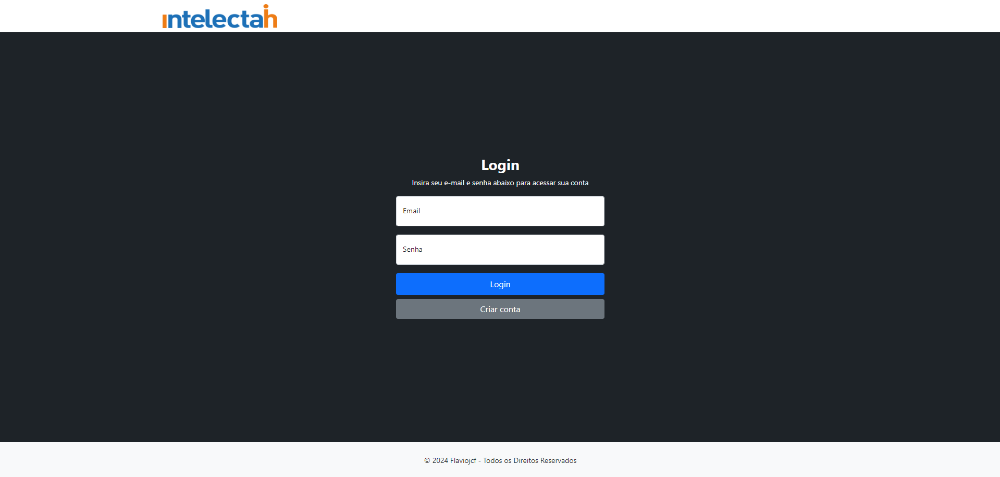

<h1 align="center">intelectah-teste</h1>

<br />
<div align="center">
  <a href="https://github.com/Flaviojcf/projects-payments">
    
  </a>
</div>

O projeto envolve o desenvolvimento de uma aplicação web para a gestão de concessionárias de veículos utilizando ASP.NET MVC e Entity Framework. A aplicação tem como objetivo gerenciar fabricantes de veículos, concessionárias, e a realização de vendas, integrando autenticação e autorização de usuários.

## Tecnologias, Arquitetura e Design Patterns
- ASP Net MVC
- Entity Framework Core
- Clean Architecture
- Repository
- CQRS
- MediatR
- FluentValidation

# Rodando a aplicação localmente

## Clonando a aplicação

``` 
https://github.com/Flaviojcf/intelectah-teste.git
```

Entre na pasta do projeto

``` 
cd intelectah-teste
```

## Configurando a String de Conexão

Abra o arquivo appsettings.json no projeto intelectah.MVC.

Atualize a string de conexão para usar o banco de dados local:

``` 

"ConnectionStrings": {
    "DefaultConnection": "Server=localhost\\SQLEXPRESS;Database=Intelectah;Integrated Security=True;TrustServerCertificate=True"
}

``` 

## Aplicando as Migrations

Abra o Package Manager Console.

Selecione o projeto intelectah.Infrastructure como o projeto padrão.

Execute o comando para aplicar as migrations

``` 

Update-Database

``` 


## Rodando a aplicação

No Visual Studio, defina intelectah.MVC como o projeto de inicialização:

Clique com o botão direito no projeto intelectah.MVC.

Selecione Set as Startup Project.

Pressione F5 para rodar em modo de depuração ou Ctrl + F5 para rodar sem depuração.

# Acessando a aplicação hospedada

``` 
https://intelectahmvc.azurewebsites.net/

```

## Contato

[@Flaviojcf](mailto:flaviojcostafilho@gmail.com)


